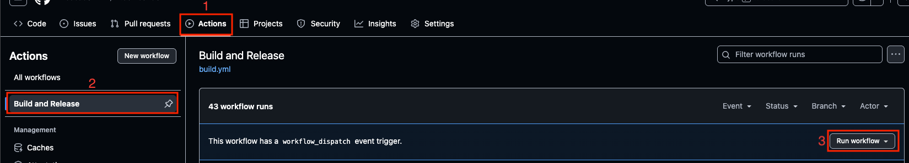

# Tool Builder

1. Vào tab `Actions`.
2. Tìm workflow `Build and Release`.
3. Chọn `Run workflow`.

4. Chọn project để build.
5. Nhập nhánh để build vào `Branch to build`.
6. Nhấn `Run workflow` để bắt đầu.
